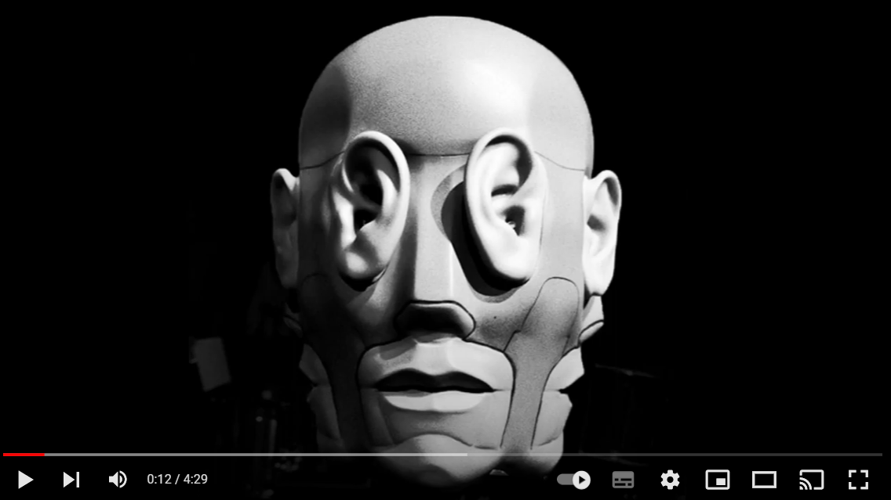

# BandMembers_position_aura
Auralization of a musical group whose members positions are defined by the user. This code was made during 'Auralization' classes, lectured by [Will D'Andrea](https://github.com/willdfonseca).

## YouTube Tutorial 

> https://www.youtube.com/watch?v=E4Od29hg_5s&ab_channel=OneiroAcoustika

## How to use
-Make sure the [API_MO-SOFA](https://github.com/sofacoustics/API_MO) is in Matlab path. Then, uncomment the 11th line, so the SOFA package starts (it's necessary to do this only once).\
-Load your sound source files. It can be any kind of audio you like. As a default setting, we chose a 30 seconds slice of a song. The musical instruments were separated by [Moises.ai](https://moises.ai/).\
-Set the sound source position (Azimuth and Elevation).\
-Then, run the code and get your auralized audio!

## Credits
Special thanks to [Davi Carvalho](https://github.com/davircarvalho) for helping us dealing with HRTFs and SOFA.

Song used:\
Living Nightmare by snowflake Ft: Blue Wave Theory\
dig.ccmixter.org/files/snowflake/54422\
(c) copyright 2016 Licensed under a Creative Commons Attribution (3.0) license.
